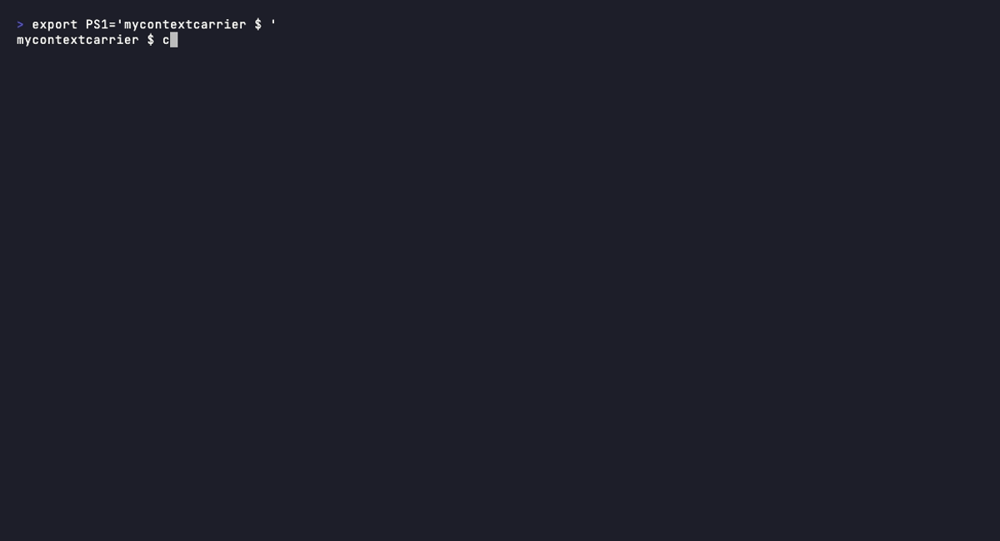

# MyContextPort

### The Universal, Portable, Private and Persistent AI Memory You Own.
MyContextPort is a privacy-gated MCP server that collects personal context locally, enforces user-defined sensitivity rules per model, and injects the right context into any MCP-compatible AI client.
> *Your context. Your data. Every AI, everywhere.*

---

[](https://github.com/Kisbjornssund/MyContextPort/actions/workflows/ci.yml)
[](LICENSE)
[]()
[]()
[](CONTRIBUTING.md)
[](https://discord.gg/NvqtCBRr)

---

<!-- DEMO GIF PLACEHOLDER -->
<!-- Replace with: terminal recording showing `mycontextport mcp serve` running, -->
<!-- then Claude demonstrating awareness of context it was never told.        -->
<!-- This is the single most important asset in this README.                  -->
<!--                                   -->

---

## The Problem No One Has Solved

**Part 1: The repetition tax.** Every AI tool you open starts from zero. You explain your project to Claude. You explain your codebase to Cursor. You explain your preferences to GPT. Every session. Every app. Every time. The AI revolution promised intelligence that *knows you*. What we got were brilliant strangers with no memory.

**Part 2: The privacy trap.** Every solution that does remember you, ChatGPT Memory, Claude Projects, Mem.ai, solves repetition by uploading your most sensitive data to cloud servers you don't control. Your browser history, calendar, work notes, emails, and financial context are transmitted to third parties. Potentially used to train models. Potentially exposed in breaches. Subject to legal demands you'll never see.

**Today's impossible choice:**
- Option A: Have AI that knows you, but surrender your personal data to corporate clouds
- Option B: Keep your data private, but re-explain yourself every single session

**MyContextPort solves both.** Your context is captured and stored locally on your machine. You decide exactly what gets shared with which AI tool — and nothing leaves your device unless you choose to inject it.

---

## Privacy Is a Spectrum, Not a Mandate

MyContextPort respects that different users have different needs:

| Mode | What it does | Who it's for |
|------|-------------|--------------|
| **Maximum privacy** | Context never leaves your device. Cloud AI receives only the synthesized injected snippet, not your raw data | Privacy-first users |
| **Selective sharing** | Per-model rules: full context to local Ollama, work-only to cloud Claude, nothing to others | Most users |
| **Transparent** | Full audit log of every injection: see exactly what data each model received | Auditors, the curious |
| **Export / delete** | Full data portability at any time. Delete everything. It's yours. | Everyone |

You don't have to care about privacy to benefit from MyContextPort. But if you do, MyContextPort is the only solution that doesn't force you to compromise.

---

## Install in 3 Commands

```bash
# Install MyContextPort
curl -fsSL https://mycontextport.dev/install.sh | sh

# Initialize your context store (interactive wizard)
mycontextport init --wizard

# Connect to Claude via MCP
mycontextport mcp serve --port 8765
```

Or with Docker:
```bash
docker run -v ~/.mycontextport:/data -p 8765:8765 ghcr.io/kisbjornssund/mycontextport:latest
```

Then add this to your Claude (or any MCP-compatible tool) config:
```json
{
  "mcp_servers": [
    { "name": "mycontextport", "url": "http://localhost:8765/mcp" }
  ]
}
```

Open Claude. Ask: *"What have I been working on?"*

Claude already knows.

> **Note:** MyContextPort is pre-alpha. The API is unstable. We love early contributors. [See how to help.](CONTRIBUTING.md)

---

## How It Works

```
┌─────────────────────────────────────────────────────┐
│                   DATA SOURCES                      │
│  Browser · Calendar · GitHub · Notes · Email · ...  │
└────────────────────┬────────────────────────────────┘
                     │ Context Collectors (Python plugins)
                     ▼
┌─────────────────────────────────────────────────────┐
│             MYCONTEXTPORT CORE (Rust)               │
│   DuckDB (structured) + Qdrant (vector) local store │
│   Context graph · Relevance ranking · Privacy rules │
│   Encrypted at rest · Keys stay on your device      │
└────────────────────┬────────────────────────────────┘
                     │ Privacy Rules Engine
                     ▼
┌─────────────────────────────────────────────────────┐
│          UNIVERSAL CONTEXT API / MCP SERVER         │
│     REST · gRPC · MCP Protocol · Python SDK         │
└────────┬───────────────────────────────┬────────────┘
         │                               │
         ▼                               ▼
┌────────────────┐             ┌─────────────────────┐
│  Claude / GPT  │             │  Cursor / Obsidian  │
│  Gemini / Llama│             │  VS Code / Any App  │
└────────────────┘             └─────────────────────┘
```

**Core stack:** Rust daemon · DuckDB · Qdrant (embedded) · MCP Protocol · Python SDK

---

## Ecosystem & Integrations

MyContextPort is an **MCP server**. Any tool that speaks MCP can query it. Your context travels
with you — not locked inside any single app.

### Works with OpenClaw

[OpenClaw](https://openclaw.ai) is a privacy-first personal AI assistant that runs locally and
connects to MCP servers. MyContextPort integrates as a single config entry:

```json
// In your openclaw.json
{
  "mcpServers": {
    "mycontextport": {
      "command": "mycontextport",
      "args": ["mcp", "serve"]
    }
  }
}
```

Once connected, OpenClaw's agentic reasoning — across WhatsApp, Telegram, Slack, Discord, and
its native macOS app — is automatically aware of your structured personal context. Privacy rules
in MyContextPort determine exactly what OpenClaw can see, per sensitivity tier.

### Works with Claude Desktop

```json
// In claude_desktop_config.json
{
  "mcpServers": {
    "mycontextport": {
      "command": "mycontextport",
      "args": ["mcp", "serve"]
    }
  }
}
```

### Works with Cursor, Zed, and any MCP client

Any editor or AI tool with MCP support connects the same way. The same context, the same privacy
rules, everywhere you work.

### Works with Ollama

MyContextPort uses [Ollama](https://ollama.com) for on-device agentic reasoning — no API keys,
no cloud, no data sent anywhere. Sensitive context (Health, Financial, Personal sensitivity tiers)
is never routed to cloud models.

```bash
# MyContextPort will use Ollama automatically if installed
ollama pull llama3
mycontextport start
```

### The full local-first stack

```
OpenClaw · Claude Desktop · Cursor · Any MCP client
                    │
                    │  MCP (stdio / localhost)
                    ▼
             MyContextPort
        (privacy engine + DuckDB)
                    │
                    ▼
               Ollama
          (local inference)
```

Everything runs on your machine. Nothing leaves without your explicit consent.

---

## Supported Collectors & AI Tools

### Collectors (what MyContextPort knows about you)

| Collector | Status | Platform |
|-----------|--------|----------|
| Browser history (Chrome, Firefox) | v0.1 | macOS, Linux |
| Markdown / Obsidian notes | v0.1 | All |
| Google Calendar / iCal | v0.2 | All |
| GitHub (repos, PRs, issues, commits) | v0.2 | All |
| VS Code activity | v0.2 | All |
| Email (IMAP, metadata-only) | v0.3 | All |
| Slack / Discord | v0.3 | All |
| Linear / Jira | v0.3 | All |
| **Your collector here** | [Contribute →](docs/docs/collectors/writing-a-collector.md) | |

### AI Tool & App Integrations

| Tool | Type | Status |
|------|------|--------|
| Claude Desktop (Anthropic) | MCP client | v0.1 |
| OpenClaw | MCP client | v0.1 |
| Cursor | MCP client | v0.1 |
| Zed | MCP client | v0.1 |
| Any MCP-compatible tool | MCP client | v0.1 |
| Ollama (local inference) | Inference backend | v0.2 |
| ChatGPT / GPT-4 | MCP client | v0.2 |
| Gemini | MCP client | v0.2 |

---

## Roadmap

| Version | Status | What Ships |
|---------|--------|-----------|
| **v0.1** | In progress | Browser + notes collectors · MCP server · CLI · Python SDK · Docker |
| **v0.2** | Planned | GitHub + Calendar collectors · Ollama native · Windows · TUI dashboard |
| **v0.3** | Planned | Relevance scoring · Email/Slack · Data portability |
| **v0.4** | Planned | Tauri desktop app · Plugin marketplace · VS Code extension |
| **v1.0** | Planned | Stable API · Security audit · Optional user-hosted sync |

---

## Contributing

MyContextPort lives or dies by its contributor community. The plugin architecture is designed so you can ship something meaningful in an afternoon.

**Build a collector** (Python, any experience level):
```python
from mycontextport import BaseCollector, ContextItem

class MyCollector(BaseCollector):
    """Collect context from my favorite tool."""

    async def collect(self) -> list[ContextItem]:
        # Your implementation here: read from a file,
        # query a local database, call a local API
        return [ContextItem(content="...", source="my-tool")]

    async def health_check(self) -> bool:
        return True
```

Scaffold a new collector instantly:
```bash
mycontextport dev new-collector --name my-tool --platform macos,linux
```

**Other ways to contribute:**

| Domain | Prerequisites | Effort |
|--------|--------------|--------|
| [Context Collectors](docs/docs/collectors/writing-a-collector.md) | Python basics | Afternoon |
| [AI Integrations](docs/docs/contributing/ai-integrations.md) | Target tool's API | Half-day |
| [Core Daemon](docs/docs/contributing/core-development.md) | Rust, async systems | Days |
| [Documentation](docs/docs/contributing/first-contribution.md) | Writing | 1-3 hours |

→ [Read CONTRIBUTING.md to get started](CONTRIBUTING.md)
→ [Your first contribution in under 3 hours](docs/docs/contributing/first-contribution.md)
→ [Join Discord](https://discord.gg/NvqtCBRr), `#collectors-dev` is where the action is

---

## Philosophy

Personal context, the accumulated record of how you think, what you work on, who you are professionally and intellectually, is among the most intimate data you generate. It should not be owned by any company. It should not be used to train models without explicit consent. It should not be locked inside any application.

MyContextPort is infrastructure for AI that respects human sovereignty. It is not a product. It is a public good.

[Read the full Manifesto →](MANIFESTO.md)

---

## Community

- **Discord:** [discord.gg/NvqtCBRr](https://discord.gg/NvqtCBRr)
- **GitHub Discussions:** [Discussions](https://github.com/Kisbjornssund/MyContextPort/discussions)
- **Twitter/X:** [@mycontextportdev](https://x.com/mycontextportdev)
- **Docs:** [docs.mycontextport.dev](https://docs.mycontextport.dev)

---

## License

MIT. Use it, fork it, build on it, sell products with it.

---

*Built in public. Owned by no one. Useful to everyone.*
